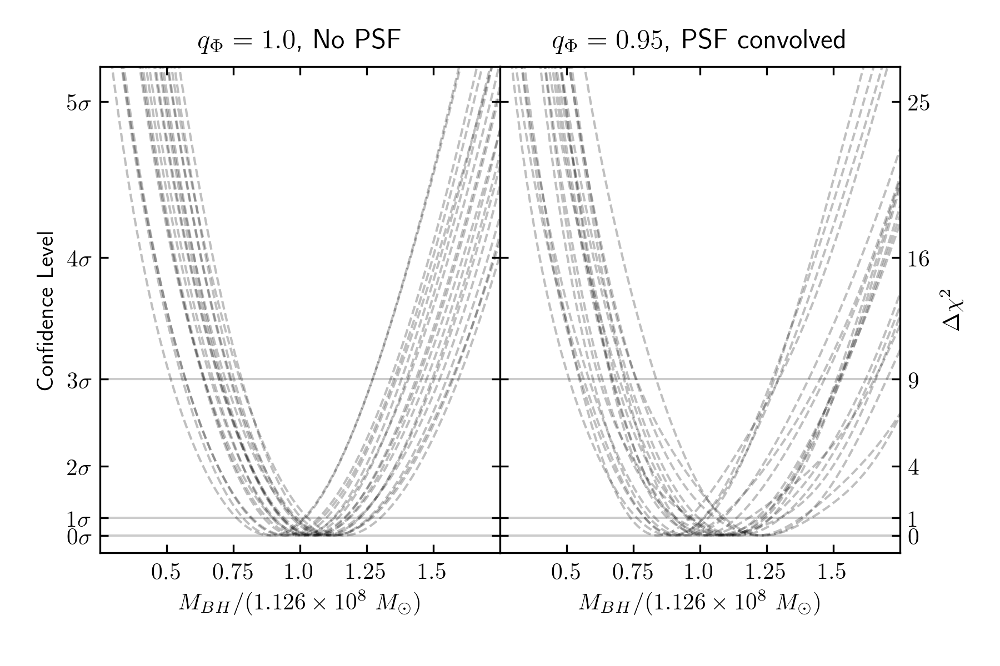
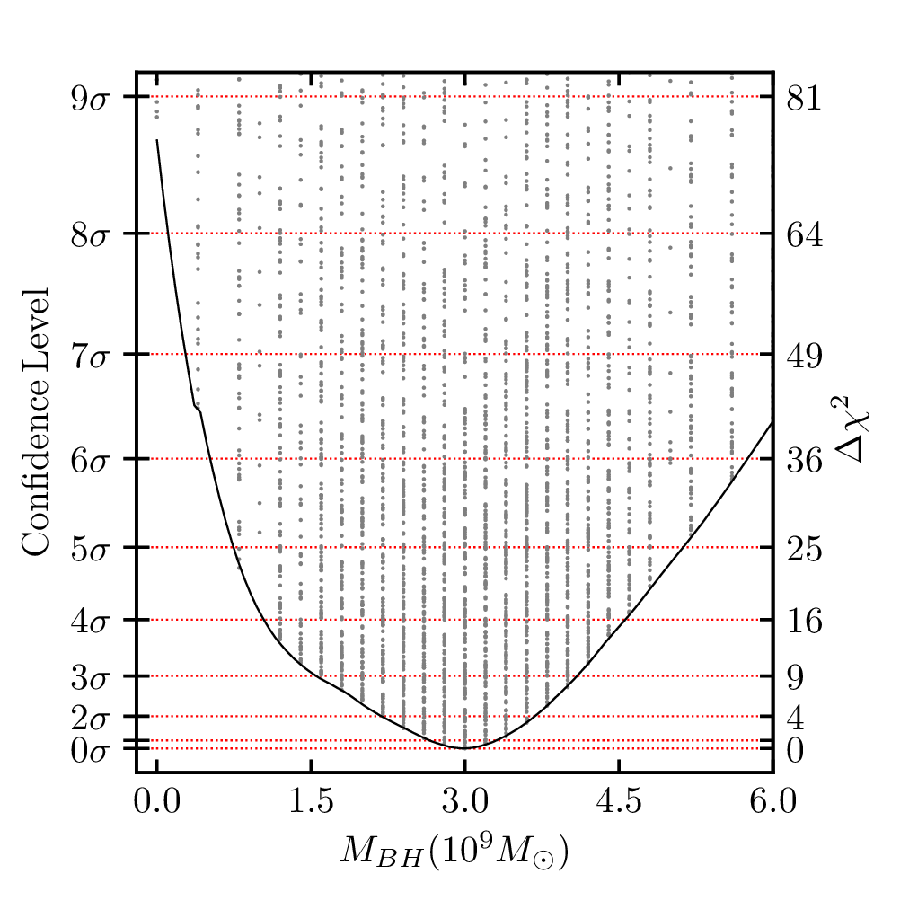

# Research

My research is focussed on learning how supermassive black holes have evolved and interacted with their host galaxies over cosmic time. In particular, I'm interested in the dynamics of stars within these galaxies, what stellar motions can tell us about the distribution of mass within these galaxies, and how these stellar orbits interact with central black holes and binaries. Much of my PhD research has been focussed on using stellar dynamical modelling to measure supermassive black hole masses in triaxial galaxies.

My goals moving forward are to extend these techniques and employ them to measure central black hole masses and shapes of nearby galaxies. The aim is to use this extended sample to learn more about the central dynamics of these galaxies, scaling relations between central black hole masses and host galaxy properties, and gravitational wave emission from supermassive black hole binaries.

***

## Triaxial Orbit Modelling

Many real galaxies show clear deviations from axisymmetry. This suggests that triaxial modelling is needed to accurately model their behaviour. Previous studies have shown that some black hole masses have changed drastically when triaxial models are used instead of axisymmetric models. In this paper, we identify and resolve several issues that affected previous triaxial black hole measurements. We also describe and implement a model search scheme that fairly samples different regions of the triaxial shape space and requires drastically fewer models, making the search much more computationally efficient. We use these results to perform a triaxial measurement of the black hole in the center of NGC 1453.  
[Read the paper](https://ui.adsabs.harvard.edu/abs/2021arXiv211106904Q/abstract)

***

## Do triaxial models work in the axisymmetric limit?

Fully triaxial modelling leads to many complexities that aren't present for axisymmetric models. Because of this, triaxial modelling codes are sometimes used to perform "nearly" axisymmetric modelling. However, some previous papers have shown significant inconsistencies by doing this. In this paper, we show how to efectively use a triaxial orbit code in the axisymmetric limit. We also show that we can accurately recover the central black hole mass in mock data.  
[Read the paper](https://ui.adsabs.harvard.edu/abs/2021ApJS..254...25Q/abstract)

***

## The central black hole in NGC 1453

NGC 1453 is a nearby massive elliptical galaxy. It rotates quickly and the rotation appears to be nearly aligned with its projected minor axis. This makes it a natural candidate for axisymmetric modelling. We performed axisymmetric modelling of NGC 1453 and found a central black hole about 3 billion times more massive than the sun! We also found that additional constraints are needed in order to make the model's kinematics realistic.
[Read the paper](https://ui.adsabs.harvard.edu/abs/2020ApJ...891....4L/abstract)

